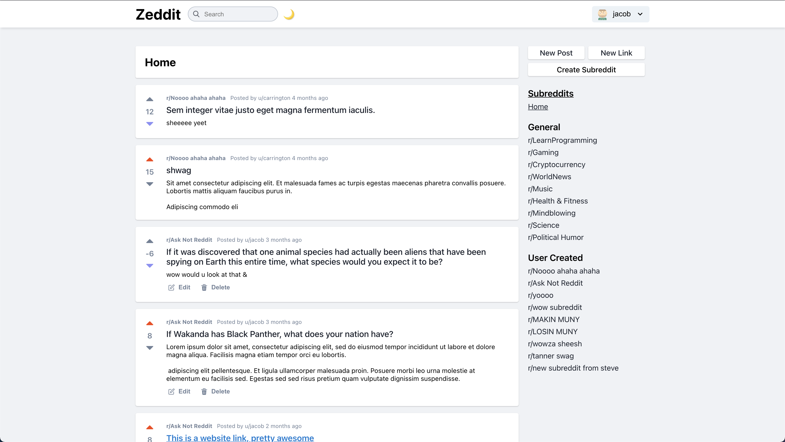
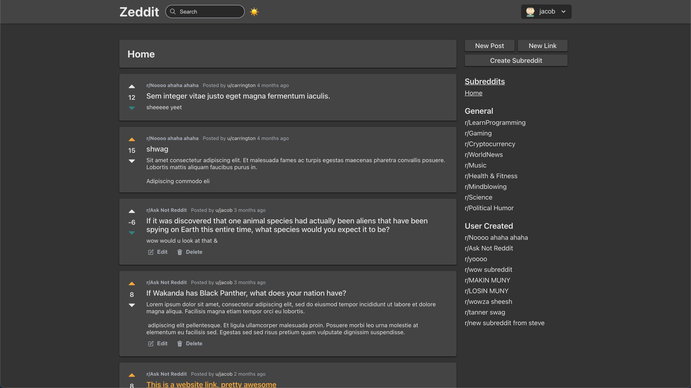
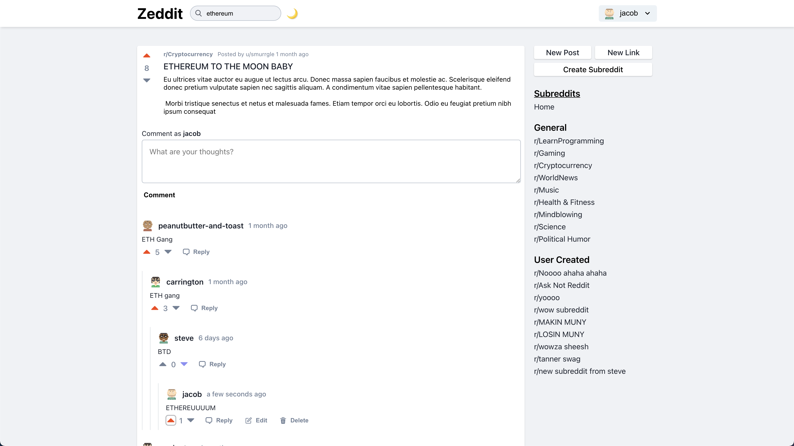
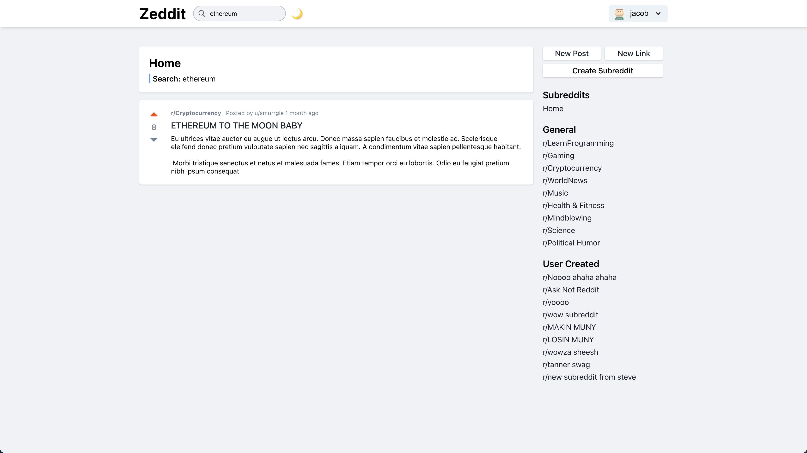
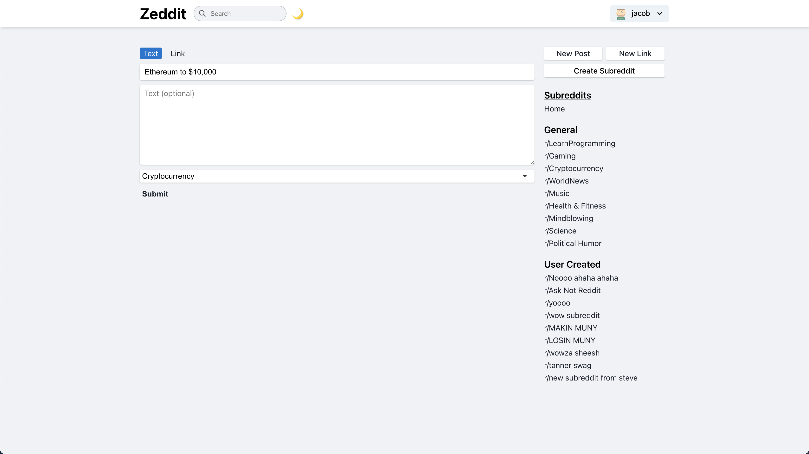

# Zeddit (Reddit Clone) (Frontend)
## A Full Stack React/Redux/Node/MySql App

Backend for this application: [Repository](https://github.com/jacobbroughton/reddit-clone-backend)

This project is my attempt at recreating a reddit-like experience. Users can create / edit / delete posts, add comments, vote on comments and posts, and create their own 'subreddits'. This has been the most challenging project i've faced thus far, my motivation to continue this project over the months of it's development really stems from the pursuit of learning as much as possible.

#### Tech stack used thus far:
<ul>
  <li>React JS</li>
  <li>Redux</li>
  <li>Node.js</li>
  <li>SQL / MySql</li>
  <li>Express</li>
  <li>HTML / CSS</li>
</ul>

---
## Home Screen

---
---
## Home Screen (Dark Mode)

---
---
## Single Post

---
---
## Search View

---
---
## New Post

